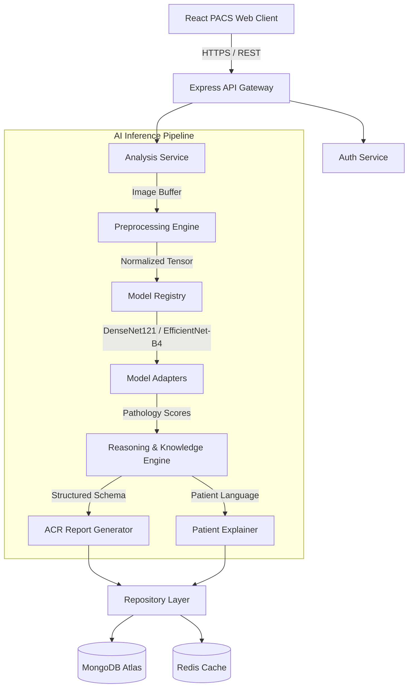

# 🏥 MedVision AI — Enterprise Medical Imaging & Diagnostics Platform

[](https://nodejs.org/)
[](https://react.dev/)
[](https://vitejs.dev/)
[](https://mongoosejs.com/)
[](LICENSE)

MedVision AI is a production-quality, enterprise-grade clinical diagnostics and PACS (Picture Archiving and Communication System) visualization platform. Designed for radiologists and clinicians, it leverages an advanced computer vision inference pipeline to automate scan interpretation, compile structured ACR-compliant (American College of Radiology) reports, translate clinical jargon into patient-friendly explanations, and manage high-resolution imaging records.

---

## 📋 Table of Contents

- [System Architecture](#-system-architecture)
- [Key Features](#-key-features)
- [Tech Stack](#-tech-stack)
- [Directory Layout](#-directory-layout)
- [Database Schema & Data Lineage](#-database-schema--data-lineage)
- [Getting Started](#-getting-started)
  - [Prerequisites](#prerequisites)
  - [Docker Orchestration (Recommended)](#docker-orchestration-recommended)
  - [Local Development Setup](#local-development-setup)
- [Environment Configurations](#-environment-configurations)
- [Clinical & HIPAA Compliance](#-clinical--hipaa-compliance)
- [Model Registry & Adaptability](#-model-registry--adaptability)

---

## 🏗️ System Architecture

MedVision AI follows clean architecture and DDD (Domain-Driven Design) principles. The repository separates presentation, decoupled core services, and stateful repository abstractions, ensuring high modularity and clean test boundaries.



### 1. Vision Model Adapters
Models are decoupled from the core application via a polymorphic model adapter interface (`ModelAdapter`). To add or swap model runtimes (e.g. PyTorch, ONNX, Triton, or Python gRPC microservices), extend the base adapter and register it in `adapterRegistry.js`.

### 2. Clinical Reasoning Engine
Vision output is parsed by a rule-based expert logic system to assign anatomical classifications, clinical differentials, diagnostic impressions, and priority/urgency labels based on ACR guidelines.

---

## ✨ Key Features

*   **Advanced PACS Imaging Viewer**: Zero-footprint web viewer with client-side canvas adjustments for windowing (brightness/contrast), rotation, zoom/pan, negative inversion, and medical bounding overlays.
*   **Structured ACR Reporting**: Generates ACR-compliant reporting structured anatomically (*Lungs & Airways*, *Pleural Spaces*, *Cardiac Silhouette*, *Mediastinum*, *Bones*, *Diaphragm*).
*   **Patient-Language Translation**: Translates dense radiological findings into simple, jargon-free explanations with actionable guidance for patients.
*   **Robust Security & Auth**: State-of-the-art refresh token rotation scheme stored in DB with strict reuse detection, cryptographic account recovery tokens, and route-based RBAC (`patient`, `doctor`, `radiologist`, `admin`).
*   **Enterprise Audit Logging**: Stateful middleware that transparently logs write actions (`CREATED`, `DELETED`, `UPDATED`) for compliance auditing.

---

## 🛠️ Tech Stack

### Backend API
*   **Runtime**: Node.js >= 18 (Express.js API)
*   **Database**: MongoDB + Mongoose ODM (strict indexing, validation, and schema control)
*   **Caching**: Redis (high-performance caching driver)
*   **Security**: Helmet, CORS origin whitelist, Express Rate Limit, JWT Bearer Token validation, and bcryptjs hashing.

### Frontend Client
*   **Framework**: React 18 + Vite (under 800ms hot-module replacement)
*   **State Management**: Zustand (lightweight, decoupled client stores)
*   **Styling**: Tailwind CSS + custom CSS custom properties (system dark/light modes)
*   **Animation**: Framer Motion (fluid viewport transitions and modal overlays)

---

## 📁 Directory Layout

```
xray-interpreter/
├── backend/
│   ├── src/
│   │   ├── ai/                      # AI Pipeline Orchestrator & Adapters
│   │   │   ├── preprocessor.js      # Image normalization & scaling
│   │   │   ├── reasoningEngine.js   # Knowledge-base reasoning rules
│   │   │   └── adapters/            # Polymorphic Model Adapters
│   │   ├── config/
│   │   │   ├── database.js          # MongoDB client wrapper
│   │   │   └── environment.js       # Dynamic ENV parser
│   │   ├── constants/               # System enums (roles, modalities, HTTP status)
│   │   ├── controllers/             # REST resource mappings
│   │   ├── middleware/              # Auth context guards, validator schemas, audit loggers
│   │   ├── models/                  # Strict Mongoose Schemas (AuditLogs, RefreshTokens, User, Analysis, Report)
│   │   ├── repositories/            # Database Query Isolation Layer
│   │   └── services/                # Decoupled Business Logic (Auth, Analysis, Reports, Cache)
│   └── uploads/                     # Local storage fallback directory
│
├── frontend/
│   ├── src/
│   │   ├── api/                     # Axios API clients & interceptors
│   │   ├── components/
│   │   │   ├── layout/              # Sidebar & Navigation Layout
│   │   │   ├── viewer/              # PACS scan adjustments viewer viewport
│   │   │   └── ui/                  # Reusable UI widgets
│   │   ├── hooks/                   # Custom Hooks (useUpload, useReports)
│   │   ├── pages/                   # App Router Views (Dashboard, History, Analysis, Reset/Forgot)
│   │   ├── store/                   # Zustand centralized store
│   │   └── styles/                  # Tailwind config & globals.css overrides
│   └── nginx.conf                   # Reverse proxy configuration
│
├── docker-compose.yml               # Multi-container local orchestration script
└── README.md
```

---

## 🗄️ Database Schema & Data Lineage

To satisfy healthcare regulations and clinical accountability, the schemas track data lineage from initial ingestion to report finalization:

*   **User**: High-security accounts with verification flags, active status, role hierarchy, and password reset tokens.
*   **Analysis**: Ingested scans, technical quality ratings (diagnostic/suboptimal/non-diagnostic), inference timings, model info, primary diagnoses, and soft-delete states.
*   **Report**: Linked directly to analysis, maintaining ACR-formatted strings, patient-friendly explanations, differential diagnoses, recommendations, and critical alert tags.
*   **RefreshToken**: Device-linked session chains containing rotation lineage, IP origins, and TTL indexes for auto-cleanup.
*   **AuditLog**: Immutable action ledger recording writing actions, IP address, user-agent, target resource, and user reference.

---

## 🚀 Getting Started

### Prerequisites

Ensure you have the following installed locally:
- **Node.js** >= 18.0.0
- **npm** >= 9.0.0
- **Docker Desktop** & **Docker Compose** (optional, for containerized run)
- **MongoDB** & **Redis** (if running locally without Docker)

---

### Docker Orchestration (Recommended)

To run the entire ecosystem (Frontend, Backend, MongoDB, Redis) in isolated containers:

```bash
# Clone the repository and navigate to root
cd xray-interpreter

# Build and start the cluster
docker-compose up --build -d

# Verify all container services are healthy
docker-compose ps
```

The app will be accessible at:
- **Frontend web client**: [http://localhost](http://localhost)
- **Backend API Gateway**: [http://localhost:5000](http://localhost:5000)
- **Health Check**: [http://localhost:5000/health](http://localhost:5000/health)

---

### Local Development Setup

#### 1. Setup Backend
```bash
cd backend
npm install

# Create environment config from template
cp .env.example .env
```
> [!IMPORTANT]
> Edit the newly created `backend/.env` and replace `MONGODB_URI` with your connection string (and fill in the correct Atlas password).

```bash
# Start backend in development reload mode
npm run dev
```

#### 2. Setup Frontend
```bash
cd ../frontend
npm install

# Start Vite server
npm run dev
```
The client will start at: [http://localhost:5173/](http://localhost:5173/) (or http://localhost:5174 if the port is occupied).

---

## ⚙️ Environment Configurations

### Backend Settings (`backend/.env`)

| Variable | Description | Default | Required in Prod |
|----------|-------------|---------|:----------------:|
| `PORT` | Local express port | `5000` | No |
| `NODE_ENV` | Mode runtime switch | `development` | Yes |
| `MONGODB_URI` | Database connection URI | `mongodb://localhost:27017/medvision-ai` | **Yes** |
| `CORS_ORIGIN` | Whitelisted frontend origin | `http://localhost:5173` | **Yes** |
| `JWT_SECRET` | HS256 secret token signing key | `change-me-in-production` | **Yes** |
| `JWT_EXPIRES_IN` | Access token lifespan | `7d` | No |
| `REFRESH_TOKEN_EXPIRES_DAYS` | Refresh token lifespan | `30` | No |
| `BCRYPT_SALT_ROUNDS` | Key derivation rounds | `12` | No |

---

## 🛡️ Clinical & HIPAA Compliance

MedVision AI incorporates several architecture patterns designed to facilitate HIPAA and GDPR compliance:

1.  **Immutable Audit Trail**: Security-relevant mutations (writes, deletions, authentication transitions) write to a dedicated, append-only `AuditLog` collection.
2.  **Explicit Consent & Quality Verification**: Every scan contains technical quality metrics, ensuring clinicians are warned of suboptimal/non-diagnostic inputs before accepting recommendations.
3.  **Encrypted Transport & Rest**: Enforces standard cryptographic hashing (`bcryptjs` for passwords, `jsonwebtoken` with short-lived lifetimes for auth context).
4.  **Soft Delete Pattern**: Prevents data loss and preserves audit records; records are flagged as `isDeleted` and excluded from normal queries automatically via Mongoose pre-find middleware.

---

## 🤖 Model Registry & Adaptability

The backend features a fully decoupled model loading scheme. Models register inside `src/ai/adapters/adapterRegistry.js`:

```javascript
// Register new models by implementing the ModelAdapter interface
const DenseNetAdapter = require('./denseNetAdapter');
const EfficientNetAdapter = require('./efficientNetAdapter');

const registry = {
  'DenseNet121': new DenseNetAdapter(),
  'EfficientNet-B4': new EfficientNetAdapter(),
};
```
Modality configurations located in `src/constants/modalities.js` specify exactly which models are supported, allowing the platform to serve multiple scan types and scale up to target new imaging formats transparently.
